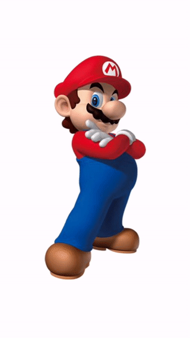
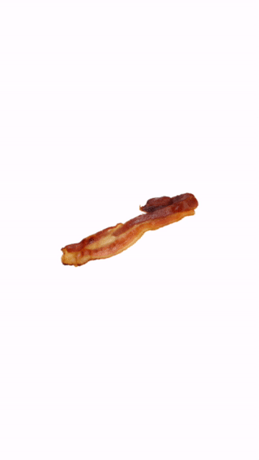
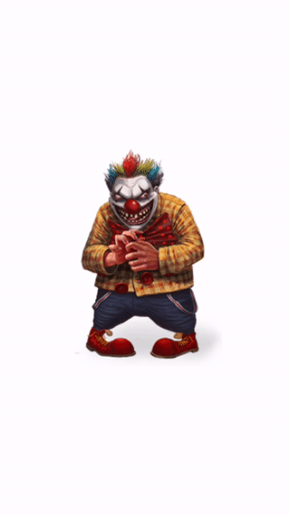

# SKDestructibleNode
This is an extension of the SKSpriteNode class and allows for destructible image nodes. It allows for an image to be rendered and used as an SKSpriteNode with the added feature of being able to be destroyed on command.  

The image is broken up into square pieces and torn apart.  Physics bodies are created based on the alpha of the piece.  Therefore, more intricate pieces will have more intricate physics bodies (and will therefore have a performance impact).  All in all, the performance stays relatively good for most images. 

### Usage

The code for the SKDestructibleNode class can be found in SKDestructibleNode.swift.

```swift
let node = SKDestructibleNode(imageName: "SinisterClown.png", scene: self, initialPosition: center, pieceSize: 25)

node.destroy()
```

The SKDestructibleNode class takes care of matching the original nodes position, rotation, velocity, etc.  

### Examples





### Caveats

* Creating the physicsBodies this way is expensive.  The simpler the image, the better the performance will be.  Squares and circles work best. 
* You will need to mess with the number of pieces for the given image.  The pieces are stored so that they can be instantly added to the scene upon destruction.  This means that the more pieces required to compose the image, the more memory will be eaten.
* Some images just don't work well with this.  Images with lots of detail (with alpha) will slow performance to a crawl. I'm working on some optimizations. 
* There is apparently a bug where physics bodies don't actually touch.  This is why there is a small amount of space between the pieces.  I'm working on finding a fix for this. 
